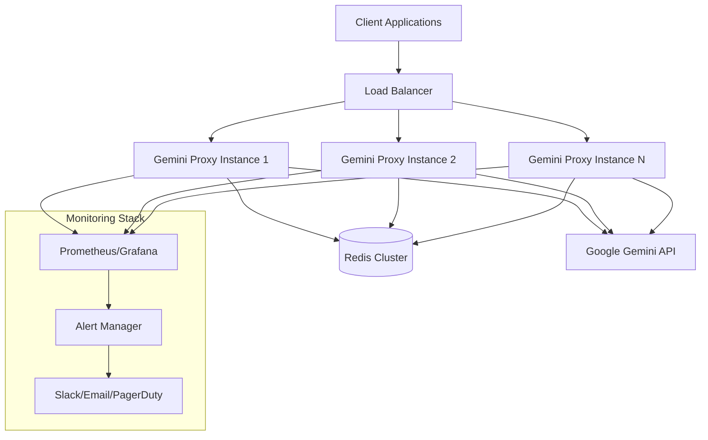
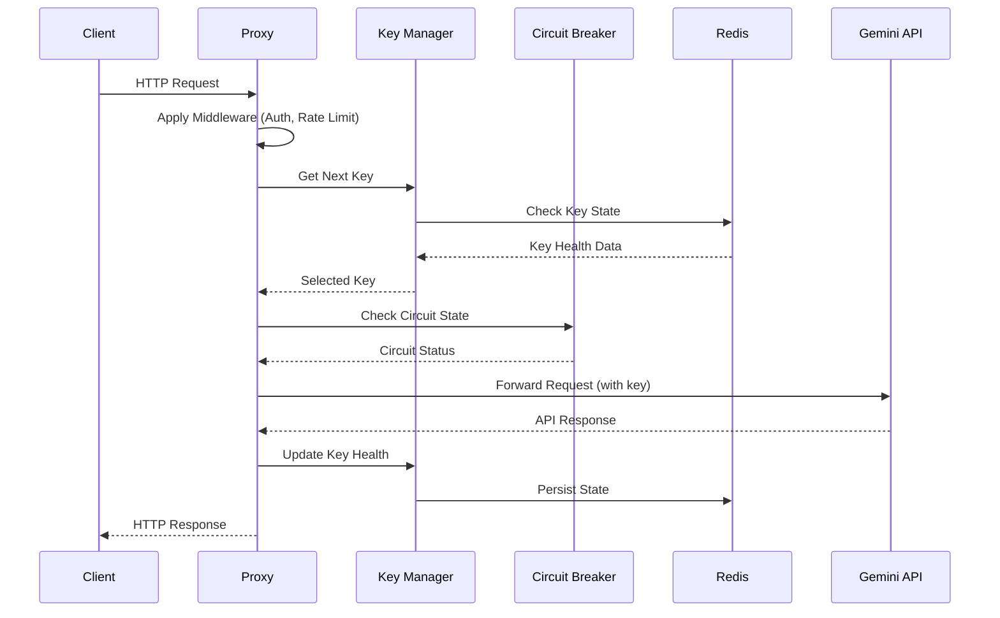
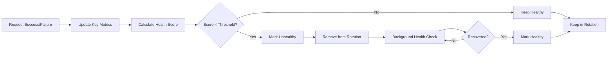
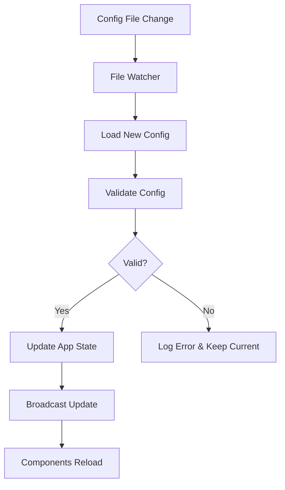

# Architecture Documentation

## Overview

Gemini Proxy is a production-ready HTTP proxy service designed for Google Gemini API with intelligent key rotation, load balancing, and comprehensive monitoring. The architecture follows industry best practices for scalability, reliability, and maintainability.

## System Architecture



## Core Components

### 1. HTTP Server Layer

**Location**: `src/main.rs`, `src/lib.rs`

- **Framework**: Axum with Tokio async runtime
- **Features**:
  - Graceful shutdown handling
  - Request/response middleware pipeline
  - Health check endpoints
  - Admin API endpoints

**Key Responsibilities**:
- Accept incoming HTTP requests
- Route requests to appropriate handlers
- Apply middleware (auth, rate limiting, metrics)
- Handle graceful shutdown signals

### 2. Configuration Management

**Location**: `src/config/`

- **Files**: `app.rs`, `loader.rs`, `validation.rs`, `environment.rs`
- **Format**: YAML with environment variable overrides
- **Features**:
  - Hot-reload capability
  - Environment-based overrides
  - Comprehensive validation
  - Secure secret handling

**Configuration Hierarchy**:
1. Default values
2. Configuration file (`config.yaml`)
3. Environment variables
4. Command-line arguments

### 3. Key Management System

**Location**: `src/key_manager.rs`, `src/key_manager_v2.rs`

**Features**:
- **Intelligent Rotation**: Round-robin with health-aware selection
- **Health Scoring**: Real-time performance metrics (0.0-1.0 scale)
- **Automatic Recovery**: Failed keys re-enter rotation when healthy
- **State Persistence**: Redis-backed state survives restarts

**Key States**:
- `Healthy`: Available for requests
- `Unhealthy`: Temporarily disabled due to failures
- `Invalid`: Permanently disabled (bad credentials)
- `RateLimited`: Temporarily disabled due to quota

### 4. Circuit Breaker Pattern

**Location**: `src/circuit_breaker.rs`

**States**:
- **Closed**: Normal operation, requests pass through
- **Open**: Failures detected, requests fail fast
- **Half-Open**: Testing if service recovered

**Configuration**:
- Failure threshold: Number of failures before opening
- Recovery timeout: Time before attempting recovery
- Success threshold: Successful requests needed to close

### 5. Rate Limiting

**Location**: `src/middleware/rate_limit.rs`

**Features**:
- IP-based rate limiting
- Configurable windows and limits
- Redis-backed for distributed limiting
- Graceful degradation when Redis unavailable

### 6. Storage Layer

**Location**: `src/storage/`

**Implementations**:
- **Redis**: Production persistence with connection pooling
- **Memory**: Development/testing fallback
- **Traits**: Pluggable storage interface

**Data Stored**:
- Key health states and metrics
- Rate limiting counters
- Circuit breaker states
- Admin session tokens

### 7. Monitoring & Metrics

**Location**: `src/metrics/`

**Metrics Collected**:
- Request metrics (count, duration, status codes)
- Key health metrics (total, healthy, unhealthy)
- Circuit breaker states and trips
- Rate limiting hits and blocks
- System metrics (memory, CPU, uptime)

**Export Formats**:
- Prometheus metrics endpoint (`/metrics`)
- Structured JSON logs
- Health check endpoints

### 8. Error Handling

**Location**: `src/error/`

**Features**:
- RFC 7807 Problem Details compliance
- Structured error responses
- Correlation IDs for tracing
- Appropriate HTTP status codes
- Comprehensive error categorization

### 9. Security Layer

**Location**: `src/security/`, `src/middleware/`

**Features**:
- Admin token authentication
- CSRF protection
- Request size limits
- Input validation and sanitization
- Security headers

## Request Flow



## Data Flow

### Key Health Scoring



### Configuration Hot-Reload



## Deployment Architecture

### Single Instance Deployment

```yaml
# docker-compose.yml
version: '3.8'
services:
  gemini-proxy:
    image: gemini-proxy:latest
    ports:
      - "4806:4806"
    environment:
      - RUST_LOG=info
      - REDIS_URL=redis://redis:6379
    volumes:
      - ./config.yaml:/app/config.yaml
    depends_on:
      - redis

  redis:
    image: redis:7-alpine
    volumes:
      - redis_data:/data
```

### High Availability Deployment

```yaml
# kubernetes deployment
apiVersion: apps/v1
kind: Deployment
metadata:
  name: gemini-proxy
spec:
  replicas: 3
  selector:
    matchLabels:
      app: gemini-proxy
  template:
    spec:
      containers:
      - name: gemini-proxy
        image: gemini-proxy:latest
        ports:
        - containerPort: 4806
        env:
        - name: REDIS_URL
          value: "redis://redis-cluster:6379"
        livenessProbe:
          httpGet:
            path: /health
            port: 4806
        readinessProbe:
          httpGet:
            path: /health/detailed
            port: 4806
```

## Performance Characteristics

### Throughput
- **Single Instance**: 10,000+ requests/second
- **Memory Usage**: ~50MB base + ~1KB per active key
- **CPU Usage**: <5% at 1000 RPS on 2-core system

### Latency
- **P50**: <5ms overhead
- **P95**: <15ms overhead
- **P99**: <50ms overhead

### Scalability
- **Horizontal**: Linear scaling with load balancer
- **Key Capacity**: 1000+ keys per instance
- **Connection Pooling**: Efficient resource utilization

## Security Considerations

### Authentication & Authorization
- Admin endpoints protected by bearer tokens
- API key validation and rotation
- Rate limiting per IP/user

### Data Protection
- Secrets stored securely (environment variables)
- TLS termination at load balancer
- No sensitive data in logs

### Network Security
- Internal Redis communication
- Firewall rules for admin endpoints
- CORS configuration for web interfaces

## Monitoring & Observability

### Metrics
- **Golden Signals**: Latency, traffic, errors, saturation
- **Business Metrics**: Key health, rotation frequency
- **System Metrics**: Memory, CPU, connections

### Logging
- **Structured Logging**: JSON format with correlation IDs
- **Log Levels**: DEBUG, INFO, WARN, ERROR
- **Sensitive Data**: Filtered from logs

### Alerting
- **Key Health**: Alert when >50% keys unhealthy
- **Error Rate**: Alert when >5% error rate
- **Response Time**: Alert when P95 >100ms
- **System Health**: Memory/CPU thresholds

## Development Workflow

### Local Development
```bash
# Start development environment
make dev-setup
make docker-run-dev

# Run tests
make test
make test-coverage

# Code quality
make lint
make format
```

### CI/CD Pipeline
1. **Code Quality**: Lint, format, security scan
2. **Testing**: Unit, integration, performance tests
3. **Build**: Multi-stage Docker build
4. **Deploy**: Staging → Production with health checks

## Future Enhancements

### Planned Features
- **Multi-region Support**: Geographic key distribution
- **Advanced Load Balancing**: Weighted round-robin
- **GraphQL Support**: Additional API format support
- **WebSocket Proxying**: Real-time connection support

### Scalability Improvements
- **Key Sharding**: Distribute keys across instances
- **Caching Layer**: Response caching for repeated requests
- **Connection Multiplexing**: HTTP/2 and HTTP/3 support

## Troubleshooting Guide

### Common Issues

1. **High Error Rate**
   - Check key health status
   - Verify Gemini API quotas
   - Review circuit breaker states

2. **Slow Response Times**
   - Monitor upstream latency
   - Check Redis connection pool
   - Review system resource usage

3. **Key Rotation Issues**
   - Verify Redis connectivity
   - Check key configuration
   - Review health check logs

### Debug Commands
```bash
# Check service health
curl http://localhost:4806/health/detailed

# View metrics
curl http://localhost:4806/metrics

# Check logs
docker logs gemini-proxy

# Redis inspection
redis-cli -h localhost -p 6379 keys "gemini_proxy:*"
```