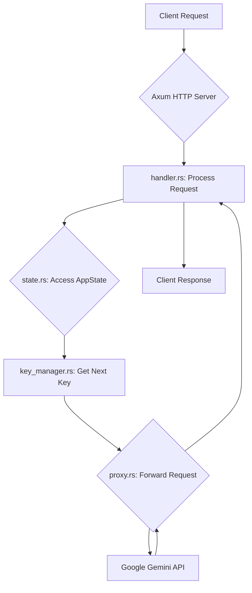
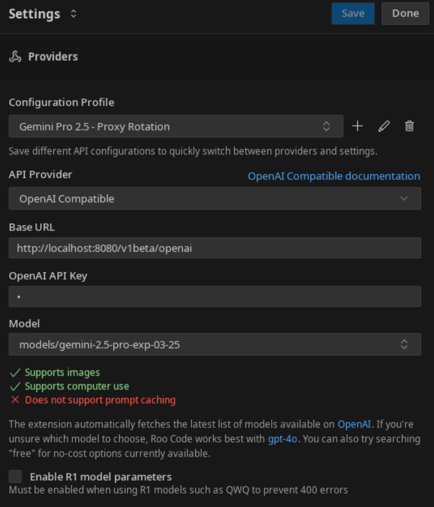

# 🚀 Gemini Proxy Key Rotation - Production Ready

[](https://github.com/stranmor/gemini-proxy-key-rotation-rust/actions/workflows/rust.yml)
[](https://opensource.org/licenses/MIT)
[](SECURITY.md)
[](#testing)

A **production-ready**, high-performance asynchronous HTTP proxy for Google Gemini models with **enterprise-grade security** and **intelligent monitoring**. Seamlessly integrates with OpenAI-compatible applications while providing advanced key rotation, load balancing, and comprehensive observability.

## ✨ What's New in v2.0

- 🔒 **Enterprise Security**: Rate limiting, HTTPS enforcement, session management
- 📊 **Intelligent Monitoring**: Proactive key health scoring (0.0-1.0), automated alerts
- 🛡️ **Circuit Breaker**: Automatic failover for upstream services
- 🔄 **Graceful Operations**: Zero-downtime restarts, proper signal handling
- 🧪 **42+ Tests**: Comprehensive test coverage for production reliability
- 📦 **Easy Installation**: One-command setup with automated installer

**📚 [Installation Guide](#-installation)** | **🔒 [Security Features](SECURITY.md)** | **📊 [Monitoring Guide](MONITORING.md)**

## 🎯 Key Benefits

### 🚀 **Performance & Reliability**
- **Smart Load Balancing**: Distributes requests across multiple Gemini keys with health-aware routing
- **Circuit Breaker Protection**: Automatic failover when upstream services are down
- **Zero-Downtime Operations**: Graceful shutdowns and rolling updates
- **Redis Persistence**: Maintains state across restarts for enterprise deployments

### 🔒 **Enterprise Security**
- **Rate Limiting**: IP-based protection with configurable thresholds
- **HTTPS Enforcement**: Production-ready TLS termination
- **Session Management**: Secure token-based authentication with automatic rotation
- **Audit Logging**: Comprehensive security event tracking

### 📊 **Intelligent Monitoring**
- **Health Scoring**: Real-time key performance metrics (0.0-1.0 scale)
- **Proactive Alerts**: Automated notifications for degraded performance
- **Detailed Analytics**: Request success rates, response times, error patterns
- **Admin Dashboard**: Web-based monitoring and management interface

### 🛠 **Developer Experience**
- **One-Command Setup**: Automated installer handles everything
- **OpenAI Compatible**: Drop-in replacement for existing applications
- **Docker Ready**: Production containers with health checks
- **Comprehensive Testing**: 42+ automated tests ensure reliability

## 🌟 Features

### 🔄 **Smart Key Management**
- **Intelligent Rotation**: Group-based round-robin with health-aware selection
- **Health Scoring**: Real-time key performance metrics (0.0-1.0 scale)
- **Automatic Recovery**: Failed keys automatically re-enter rotation when healthy
- **State Persistence**: Redis-backed state survives restarts and scaling

### 🛡️ **Enterprise Security**
- **Rate Limiting**: Configurable IP-based protection (5 attempts/5 minutes default)
- **HTTPS Enforcement**: Production-ready TLS with security headers
- **Session Management**: Secure token-based admin authentication
- **Audit Logging**: Comprehensive security event tracking
- **Request Validation**: Size limits and input sanitization

### 📊 **Advanced Monitoring**
- **Proactive Health Checks**: Background monitoring every 30 seconds
- **Automated Alerts**: Notifications when >3 keys unhealthy or error rate >10%
- **Performance Metrics**: Response times, success rates, usage patterns
- **Admin Dashboard**: Web-based monitoring at `/admin/`
- **Detailed Analytics**: Per-key and per-group statistics

### 🚀 **High Performance**
- **Async Architecture**: Built on Tokio for maximum throughput
- **Circuit Breaker**: Automatic failover for upstream services
- **Connection Pooling**: Efficient HTTP client management
- **Graceful Shutdown**: Zero-downtime deployments with proper signal handling

### 🔧 **Developer Experience**
- **OpenAI Compatible**: Drop-in replacement for existing applications
- **Flexible Configuration**: Single YAML file with hot-reload support
- **Multiple Deployment Options**: Docker, systemd, or direct binary
- **Comprehensive Testing**: 42+ automated tests ensure reliability

## Architecture

The Gemini Proxy Key Rotation service is built with a modular architecture, leveraging Rust's ownership and concurrency features to ensure high performance and reliability. Below are the core components and their interactions:

*   [`main.rs`](src/main.rs): The entry point of the application. It initializes logging, loads the configuration, sets up the `KeyManager` and `AppState`, and starts the Axum HTTP server.
*   [`config.rs`](src/config.rs): Handles loading and validating the application's configuration from the `config.yaml` file. It defines how API key groups, proxy URLs, and target URLs are parsed and structured.
*   [`key_manager.rs`](src/key_manager.rs): Manages the lifecycle of Gemini API keys. It's responsible for loading keys, selecting the next available key using a group round-robin strategy, tracking rate limits, and persisting key states to `key_states.json`.
*   [`state.rs`](src/state.rs): Defines the shared application state (`AppState`) that is accessible across different request handlers. This includes the `KeyManager`, configuration, and other shared resources.
*   [`handlers/mod.rs`](src/handlers/mod.rs): Contains the Axum request handlers. It processes incoming HTTP requests, interacts with the `KeyManager` to get an API key, and prepares the request for forwarding.
*   [`proxy.rs`](src/proxy.rs): Responsible for forwarding the modified HTTP request to the actual Google Gemini API endpoint (or an upstream proxy if configured). It handles the network communication and returns the response to the client.

**Request Flow Diagram:**



## 📦 Installation

### 🚀 **Quick Install (Recommended)**

The easiest way to get started - our installer handles everything:

```bash
# Download and run the installer
curl -fsSL https://raw.githubusercontent.com/stranmor/gemini-proxy-key-rotation-rust/main/install.sh | bash

# Or download first to review:
wget https://raw.githubusercontent.com/stranmor/gemini-proxy-key-rotation-rust/main/install.sh
chmod +x install.sh
./install.sh
```

The installer will:
- ✅ Install Rust and Docker (if needed)
- ✅ Clone the repository
- ✅ Build the application
- ✅ Set up configuration files
- ✅ Create systemd service (Linux)
- ✅ Run tests to verify installation

### 🐳 **Оптимизированная Docker сборка**

Полностью переработанная Docker сборка с максимальной эффективностью:

```bash
git clone https://github.com/stranmor/gemini-proxy-key-rotation-rust.git
cd gemini-proxy-key-rotation-rust

# Автоматическая оптимизация и настройка
./scripts/docker-optimize.sh

# Или быстрый старт
make quick-start
nano config.yaml  # Добавьте ваши Gemini API ключи

# Запуск (выберите нужный режим)
make docker-run              # Продакшн (порт 8080)
make docker-run-dev          # Разработка (порт 8081)
make docker-run-with-tools   # + Redis UI (порт 8082)
```

**🚀 Ключевые улучшения:**
- Размер образа уменьшен до ~50MB (Distroless)
- Время сборки ускорено в 3-5 раз (cargo-chef)
- Максимальная безопасность (непривилегированный пользователь)
- Эффективное кэширование зависимостей

### 🛠 **Manual Installation**

If you prefer manual control:

```bash
# Prerequisites
# - Rust 1.70+ (https://rustup.rs/)
# - Docker (optional, for Redis)

git clone https://github.com/stranmor/gemini-proxy-key-rotation-rust.git
cd gemini-proxy-key-rotation-rust

# Build
make build

# Configure
cp config.example.yaml config.yaml
# Edit config.yaml with your API keys

# Run
make run
```

## 🔑 Requirements

- **Google Gemini API Keys**: Get them from [Google AI Studio](https://aistudio.google.com/app/apikey)
- **System**: Linux, macOS, or Windows with WSL2
- **Memory**: 512MB RAM minimum, 1GB+ recommended for production
- **Storage**: 100MB for application, additional space for logs

## ⚡ Quick Start

### 🎯 **3-Step Setup**

1. **Install & Configure**
   ```bash
   curl -fsSL https://raw.githubusercontent.com/stranmor/gemini-proxy-key-rotation-rust/main/install.sh | bash
   cd ~/gemini-proxy
   nano config.yaml  # Add your Gemini API keys
   ```

2. **Start the Proxy**
   ```bash
   # Option A: Docker (Recommended)
   make docker-run
   
   # Option B: Direct binary
   make run
   
   # Option C: Systemd service (Linux)
   sudo systemctl start gemini-proxy
   ```

3. **Verify & Use**
   ```bash
   # Check health
   curl http://localhost:8081/health
   
   # Test with your OpenAI client
   # Base URL: http://localhost:8081
   # API Key: any-dummy-key (ignored, real keys managed internally)
   ```

### 📊 **Monitoring Dashboard**

Access the admin panel at `http://localhost:8081/admin/` (configure `admin_token` in config.yaml):

- 📈 Real-time key health scores
- 📊 Request success rates and response times  
- 🔧 Key management and configuration
- 🚨 Alert history and system status

### 🔄 **Common Operations**

```bash
# View status
make status

# View logs
make logs

# Restart services
make docker-restart

# Run health check
make health

# Update configuration
nano config.yaml
make docker-restart  # Apply changes
```

### Personal Persistent Development Container (for Active Development)

This method starts a single, persistent, and isolated container for your development work. It will not be affected by other agents or standard `make` commands.

1.  **Start the Container:**
    *   Run the following command. It will build the image and start a container with a unique name and a random, free port on your local machine.
    ```bash
    make start-dev
    ```

2.  **Check the Output:**
    *   The script will print the container ID and the exact address (e.g., `127.0.0.1:49155`) you can use to connect to your personal proxy.

3.  **Stopping Your Personal Container:**
    *   Since the container has a unique name, you'll need to find it first and then stop it.
    ```bash
    # Find your container
    docker ps | grep "gemini-proxy-dev"

    # Stop it using its ID or name
    docker stop <container_id_or_name>
    ```

### Building and Running Locally (for Development)
Use this primarily for development.

1.  **Clone Repository:** (If needed)
    ```bash
    git clone https://github.com/stranmor/gemini-proxy-key-rotation-rust.git
    cd gemini-proxy-key-rotation-rust
    ```
2.  **Prepare Configuration:**
    *   Copy `config.example.yaml` to `config.yaml`.
    *   Edit `config.yaml` to define your `server.port` and `groups`.
3.  **Build:**
    ```bash
    cargo build --release
    ```
4.  **Run:**
    ```bash
    # Set the log level (optional)
    export RUST_LOG="info"

    # Run the binary
    ./target/release/gemini-proxy-key-rotation-rust
    ```
    *   *(The `key_states.json` file will be created/updated in the current working directory)*

Once the proxy is running, configure your OpenAI client (e.g., Python/JS libraries, Roo Code/Cline, etc.) as follows:

1.  **Set the Base URL / API Host:** Point the client to the proxy's address (protocol, host, port only).
    *   Example: `http://localhost:8081` (or the host port you set in `config.yaml`)
    *   **Do NOT include `/v1` or other paths in the Base URL.**

2.  **Set the API Key:** Enter **any non-empty placeholder** (e.g., "dummy-key", "ignored"). The proxy manages the *real* Gemini keys internally and **ignores the key sent by the client**, but the field usually requires input.

3.  **Send Requests:** Make requests as you normally would using the OpenAI client library or tool (e.g., to `/v1/chat/completions`, `/v1/models`, etc.). The proxy will intercept these, add the correct Google authentication for the OpenAI compatibility layer using a rotated key, and forward them.

### Example (`curl` to proxy)

**Example `curl` request:**
```bash
# Example request to list models via the proxy (replace 8081 with your host port)
curl http://localhost:8081/v1/models \
  -H "Authorization: Bearer dummy-ignored-key" # This header is ignored/replaced

# Example request for chat completion via the proxy (replace 8081 with your host port)
curl http://localhost:8081/v1/chat/completions \
  -H "Authorization: Bearer dummy-ignored-key" \
  -H "Content-Type: application/json" \
  -d '{
    "model": "gemini-1.5-flash-latest",
    "messages": [{"role": "user", "content": "Explain Rust."}],
    "temperature": 0.7
  }'
```

## Configuration

1.  In API settings, select **"OpenAI Compatible"** as **API Provider**.
2.  Set **Base URL** to the proxy address (e.g., `http://localhost:8081`).
3.  Set **API Key** to any non-empty placeholder (e.g., "dummy").

**Example Configuration Screenshot:**


## API Reference

The proxy exposes a minimal set of HTTP endpoints designed for compatibility with OpenAI clients and for health monitoring.

### Endpoints

*   **`GET /health`**
    *   **Purpose:** A simple health check endpoint.
    *   **Description:** Returns a `200 OK` status code if the proxy is running and responsive. This is useful for load balancers, Docker health checks, and basic monitoring. Note that a more comprehensive check is available at `GET /health/detailed`.
    *   **Example:**
        ```bash
        curl http://localhost:8081/health
        # Expected Response: HTTP/1.1 200 OK (empty body)
        ```

*   **`GET /health/detailed`**
    *   **Purpose:** A comprehensive health check that verifies API key validity.
    *   **Description:** Performs a live, lightweight API call to Google using one of the available keys to ensure it's valid and not rate-limited. This provides a stronger guarantee that the proxy is fully functional.
    *   **Example:**
        ```bash
        curl http://localhost:8081/health/detailed
        # Expected Response: HTTP/1.1 200 OK (with JSON body confirming success)
        ```

*   **`/v1/*` (Proxy Endpoint)**
    *   **Purpose:** Acts as a transparent proxy for OpenAI-compatible API requests.
    *   **Description:** All requests sent to the proxy with a path starting `/v1/` (e.g., `/v1/chat/completions`, `/v1/models`) are intercepted. The proxy then:
        1.  Selects an available Gemini API key using its internal rotation logic.
        2.  Adds the necessary `x-goog-api-key` and `Authorization: Bearer <key>` headers.
        3.  Rewrites the request URL to target `https://generativelanguage.googleapis.com/v1beta/openai/` (or a group-specific `target_url` if configured).
        4.  Forwards the request to the Google Gemini API.
        5.  Returns the response from Google Gemini API back to the client.
    *   **Compatibility:** Designed to work seamlessly with standard OpenAI client libraries and tools.
    *   **Example:** (See [Example `curl` to proxy](#example-curl-to-proxy) for usage examples)

## ⚙️ Configuration

### 📝 **Basic Configuration**

The `config.yaml` file is your single source of truth. Start with the example:

```yaml
# config.yaml - Production Configuration
server:
  port: 8081
  admin_token: "your-secure-admin-token-here"  # Generate with: openssl rand -hex 32
  
  # Security settings
  security:
    require_https: true
    max_login_attempts: 5
    lockout_duration_secs: 3600
    session_timeout_secs: 86400
  
  # Performance tuning
  connect_timeout_secs: 10
  request_timeout_secs: 60

# Redis for production persistence
redis_url: "redis://localhost:6379"
redis_key_prefix: "gemini_proxy:"

# Key management
max_failures_threshold: 3
temporary_block_minutes: 5

# API key groups with intelligent routing
groups:
  - name: "Primary"
    api_keys:
      - "your-gemini-api-key-1"
      - "your-gemini-api-key-2"
    target_url: "https://generativelanguage.googleapis.com/v1beta/openai/"
    
  - name: "Backup"
    api_keys:
      - "your-backup-key-1"
    proxy_url: "socks5://proxy.example.com:1080"  # Optional upstream proxy
```

### 🔧 **Advanced Configuration**

```yaml
# Circuit breaker settings
circuit_breaker:
  failure_threshold: 5
  recovery_timeout_secs: 60
  success_threshold: 3

# Rate limiting
rate_limit:
  requests_per_minute: 100
  burst_size: 20

# Monitoring and alerts
monitoring:
  health_check_interval_secs: 30
  alert_thresholds:
    unhealthy_keys: 3
    error_rate: 0.1  # 10%
    response_time_secs: 5
```

### 🎛️ **Environment Variables**

```bash
# Logging level
export RUST_LOG=info  # debug, info, warn, error

# Override config file location
export CONFIG_PATH=/path/to/config.yaml

# Redis connection (overrides config.yaml)
export REDIS_URL=redis://localhost:6379
```

## 🔍 Monitoring & Observability

### 📊 **Health Endpoints**

```bash
# Basic health check (liveness probe)
curl http://localhost:8081/health

# Detailed health with key validation (readiness probe)
curl http://localhost:8081/health/detailed

# Metrics endpoint (Prometheus compatible)
curl http://localhost:8081/metrics
```

### 🎛️ **Admin Dashboard**

Access the web-based admin panel at `http://localhost:8081/admin/`:

- **Real-time Metrics**: Key health scores, success rates, response times
- **Key Management**: View status, manually disable/enable keys
- **System Health**: Circuit breaker status, Redis connectivity
- **Configuration**: Hot-reload settings without restart
- **Alert History**: View past incidents and recovery times

### 📈 **Key Health Scoring**

Each API key gets a health score from 0.0 (unhealthy) to 1.0 (perfect):

- **1.0**: Perfect performance, no recent failures
- **0.8-0.9**: Good performance, occasional failures
- **0.5-0.7**: Degraded performance, frequent failures  
- **0.0-0.4**: Poor performance, mostly failing
- **Blocked**: Temporarily disabled due to consecutive failures

### 🚨 **Automated Alerts**

The system automatically generates alerts when:

- **>3 keys unhealthy**: Indicates potential API quota issues
- **Error rate >10%**: System-wide performance degradation
- **Response time >5s**: Upstream service slowdown
- **Circuit breaker open**: Upstream service completely down

### 📋 **Logging**

Structured JSON logging with correlation IDs:

```bash
# View logs
make logs

# Filter by level
RUST_LOG=debug make run

# Production logging
RUST_LOG=info,gemini_proxy=debug make docker-run
```

The proxy is designed to handle errors from the Gemini API gracefully:

*   **Immediate Failure (400, 404, 504):**
    *   These errors indicate a problem with the client's request (`400 Bad Request`, `404 Not Found`) or a gateway timeout (`504 Gateway Timeout`) that is unlikely to be resolved by a retry.
    *   **Action:** The error is immediately returned to the client without attempting to use another key.

*   **Invalid Key (403 Forbidden):**
    *   This error strongly indicates that the API key is invalid, revoked, or lacks the necessary permissions.
    *   **Action:** The key is marked as `Invalid` and permanently removed from the rotation for the current session to prevent further useless attempts.

*   **Rate Limiting (429 Too Many Requests):**
    *   This is a common, temporary state indicating the key has exceeded its request quota.
    *   **Action:** The key is temporarily disabled, and the proxy automatically retries the request with the next available key in the rotation.

*   **Server Errors (500, 503):**
    *   These errors (`500 Internal Server Error`, `503 Service Unavailable`) suggest a temporary problem on Google's end.
    *   **Action:** The proxy will perform a fixed number of retries (currently 2) with the *same key* using a fixed 1-second delay between attempts. If all retries fail, the key is then temporarily disabled, and the system moves to the next key.

### 🐳 Оптимизированные Docker команды

**Основные команды:**
```bash
make docker-run              # Запуск продакшн среды
make docker-run-dev          # Режим разработки с hot-reload
make docker-run-with-tools   # + Redis UI и мониторинг
make docker-test             # Запуск тестов в контейнере
make docker-coverage         # Анализ покрытия кода
```

**Управление:**
```bash
make docker-logs             # Просмотр логов приложения
make docker-logs-all         # Все логи сервисов
make docker-stop             # Остановка сервисов
make docker-restart          # Перезапуск
make docker-clean            # Очистка ресурсов
```

**Сборка:**
```bash
make docker-build            # Оптимизированная сборка
make docker-build-dev        # Сборка для разработки
./scripts/docker-optimize.sh # Полная оптимизация
```

## 🔒 Security & Production Deployment

### 🛡️ **Security Features**

- **Rate Limiting**: IP-based protection (5 attempts/5 minutes, 1-hour lockout)
- **HTTPS Enforcement**: Automatic redirect in production environments
- **Session Management**: Secure token-based authentication with rotation
- **Input Validation**: Request size limits and sanitization
- **Audit Logging**: All security events logged with correlation IDs
- **CSRF Protection**: Admin panel protected against cross-site attacks

### 🏭 **Production Deployment**

#### **Оптимизированный Docker Compose**
```bash
# Полная оптимизация системы
./scripts/docker-optimize.sh

# Продакшн развертывание
make docker-run                    # Основные сервисы (50MB образ)

# С инструментами мониторинга
make docker-run-with-tools         # + Redis UI, метрики

# Горизонтальное масштабирование
docker-compose up -d --scale gemini-proxy=3

# Проверка состояния
make status                        # Статус всех сервисов
make health-detailed               # Детальная диагностика
```

**📊 Преимущества оптимизированной сборки:**
- Размер образа: ~50MB (вместо 1.2GB)
- Время сборки: ускорение в 3-5 раз
- Безопасность: Distroless + непривилегированный пользователь
- Мониторинг: Встроенные health checks и метрики

#### **Kubernetes Deployment**
```yaml
# k8s-deployment.yaml
apiVersion: apps/v1
kind: Deployment
metadata:
  name: gemini-proxy
spec:
  replicas: 3
  selector:
    matchLabels:
      app: gemini-proxy
  template:
    metadata:
      labels:
        app: gemini-proxy
    spec:
      containers:
      - name: gemini-proxy
        image: gemini-proxy:latest
        ports:
        - containerPort: 8081
        env:
        - name: RUST_LOG
          value: "info"
        livenessProbe:
          httpGet:
            path: /health
            port: 8081
        readinessProbe:
          httpGet:
            path: /health/detailed
            port: 8081
```

#### **Systemd Service (Linux)**
```bash
# Installed automatically by install.sh
sudo systemctl enable gemini-proxy
sudo systemctl start gemini-proxy
sudo systemctl status gemini-proxy

# View logs
sudo journalctl -u gemini-proxy -f
```

### 🔐 **Security Best Practices**

1. **Generate Secure Admin Token**:
   ```bash
   make generate-admin-token
   ```

2. **Use HTTPS in Production**:
   ```yaml
   server:
     security:
       require_https: true
   ```

3. **Network Security**:
   - Deploy behind a reverse proxy (Nginx/Traefik)
   - Use firewall rules to restrict access
   - Consider VPN for admin panel access

4. **Key Management**:
   - Rotate API keys regularly
   - Use separate keys for different environments
   - Monitor key usage in Google AI Studio

5. **Backup Configuration**:
   ```bash
   make backup-config
   ```

## 🧪 Testing

The project includes comprehensive test coverage with 42+ automated tests:

```bash
# Run all tests
make test

# Run only critical tests (security, monitoring, error handling)
make test-critical

# Run with coverage report
make test-coverage

# Run security audit
make security-scan
```

### Test Categories:
- **Security Tests** (7 tests): Rate limiting, HTTPS enforcement, token management
- **Monitoring Tests** (12 tests): Health scoring, proactive checks, alerts
- **Error Handling Tests** (3 tests): Structured error responses
- **Integration Tests** (20+ tests): End-to-end functionality
- **Unit Tests** (20+ tests): Individual component testing

## 🤝 Contributing

We welcome contributions! Here's how to get started:

1. **Fork the repository**
2. **Set up development environment**:
   ```bash
   make dev-setup
   ```
3. **Make your changes**
4. **Run tests**:
   ```bash
   make check  # Runs lint, format, and tests
   ```
5. **Submit a pull request**

### Development Commands:
```bash
make dev-setup    # Complete development setup
make build-dev    # Build in development mode
make run-dev      # Run with debug logging
make format       # Format code
make lint         # Run clippy linter
```

## 📄 License

This project is licensed under the MIT License - see the [LICENSE](LICENSE) file for details.

## 🙏 Acknowledgments

- Built with [Rust](https://www.rust-lang.org/) and [Tokio](https://tokio.rs/)
- HTTP framework: [Axum](https://github.com/tokio-rs/axum)
- Redis integration: [deadpool-redis](https://github.com/bikeshedder/deadpool)
- Security: [secrecy](https://github.com/iqlusioninc/crates/tree/main/secrecy)

## 📞 Support

- **Documentation**: Check the [docs](docs/) directory
- **Issues**: [GitHub Issues](https://github.com/stranmor/gemini-proxy-key-rotation-rust/issues)
- **Security**: See [SECURITY.md](SECURITY.md) for security policy
- **Discussions**: [GitHub Discussions](https://github.com/stranmor/gemini-proxy-key-rotation-rust/discussions)

---

<div align="center">

**⭐ Star this repository if it helped you!**

Made with ❤️ for the developer community

</div>
