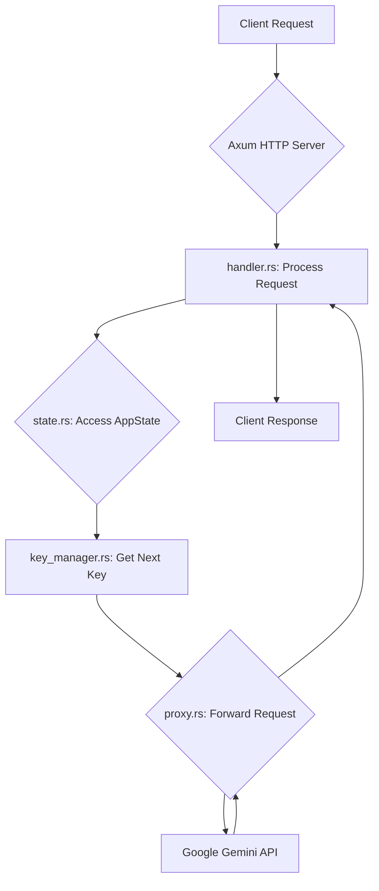

# Gemini Proxy Key Rotation (Rust) - OpenAI Compatibility

[](https://github.com/stranmor/gemini-proxy-key-rotation-rust/actions/workflows/rust.yml)
[](https://opensource.org/licenses/MIT)

A lightweight, high-performance asynchronous HTTP proxy for Google Gemini models, designed to be compatible with the OpenAI API. This proxy rotates Google Gemini API keys, distributes load, and manages rate limits, allowing you to use Gemini models with your existing OpenAI-compatible applications.

**🚀 [Quick Start Guide](QUICKSTART.md)** | **🔒 [Security Guide](SECURITY.md)** | **📝 [Changelog](CHANGELOG.md)**

## Key Benefits

*   **Avoid Rate Limits:** Distributes requests across many Gemini keys.
*   **Increased Availability:** If one key hits its limit, the proxy automatically switches to another.
*   **Simplified Configuration:** All settings are managed in a single `config.yaml` file, making configuration straightforward and predictable.
*   **Simplified Client Configuration:** Point your OpenAI client's base URL to this proxy; no need to manage Gemini keys in the client.
*   **Group-Specific Routing:** Use different upstream proxies (`http`, `https`, `socks5`) for different sets of keys.
*   **State Persistence:** Remembers rate-limited keys between restarts using Redis (optional) or in-memory storage, avoiding checks on known limited keys.

## Features

*   Proxies requests specifically to Google's OpenAI compatibility endpoint (`https://generativelanguage.googleapis.com/v1beta/openai/` by default).
*   Supports multiple **groups** of Gemini API keys with optional upstream proxies (`http`, `https`, `socks5`) per group, all configured in `config.yaml`.
*   **Group Round-Robin Key Rotation:** Selects the next available key by iterating through key groups sequentially (round-robin between groups) and then iterating through keys within the selected group. This ensures fairer distribution across groups compared to rotating through all keys flattened.
*   Handles `429 Too Many Requests` responses from the target API by temporarily disabling the rate-limited key.
*   **Rate Limit Management:** Tracks rate-limited keys and automatically retries with different keys when limits are hit.
*   **Persists Rate Limit State:** Optionally saves key states to Redis for persistence across restarts, or uses in-memory storage for single-instance deployments.
*   Configuration is managed entirely through the `config.yaml` file.
*   Injects a configurable `top_p` value into outgoing `generateContent` requests.
*   Correctly adds the required `x-goog-api-key` and `Authorization: Bearer <key>` headers, replacing any client-sent `Authorization` headers.
*   High performance asynchronous request handling using Axum and Tokio.
*   Graceful shutdown handling (`SIGINT`, `SIGTERM`).
*   Configurable logging using `tracing` and the `RUST_LOG` environment variable.
*   Health check endpoints: a basic one at `/health` and a detailed one at `/health/detailed`.
*   **Security Features:** Request size limits, rate limiting, timing-attack protection, secure logging (API keys are masked).

## Architecture

The Gemini Proxy Key Rotation service is built with a modular architecture, leveraging Rust's ownership and concurrency features to ensure high performance and reliability. Below are the core components and their interactions:

*   [`main.rs`](src/main.rs): The entry point of the application. It initializes logging, loads the configuration, sets up the `KeyManager` and `AppState`, and starts the Axum HTTP server.
*   [`config.rs`](src/config.rs): Handles loading and validating the application's configuration from the `config.yaml` file. It defines how API key groups, proxy URLs, and target URLs are parsed and structured.
*   [`key_manager.rs`](src/key_manager.rs): Manages the lifecycle of Gemini API keys. It's responsible for loading keys, selecting the next available key using a group round-robin strategy, tracking rate limits, and persisting key states to `key_states.json`.
*   [`state.rs`](src/state.rs): Defines the shared application state (`AppState`) that is accessible across different request handlers. This includes the `KeyManager`, configuration, and other shared resources.
*   [`handlers/mod.rs`](src/handlers/mod.rs): Contains the Axum request handlers. It processes incoming HTTP requests, interacts with the `KeyManager` to get an API key, and prepares the request for forwarding.
*   [`proxy.rs`](src/proxy.rs): Responsible for forwarding the modified HTTP request to the actual Google Gemini API endpoint (or an upstream proxy if configured). It handles the network communication and returns the response to the client.

**Request Flow Diagram:**



## Requirements

*   **Docker or Podman:** The easiest and **most secure** way to run the proxy. ([Install Docker](https://docs.docker.com/engine/install/)).
*   **Google Gemini API Keys:** Obtain these from [Google AI Studio](https://aistudio.google.com/app/apikey).
*   **(Optional) Rust & Cargo:** Only needed if you want to build or develop locally without Docker. ([Install Rust](https://rustup.rs/)) (Uses Rust 2021 Edition or later).

## Getting Started

### Running with Docker (Recommended)

This is the easiest and fastest way to get the proxy running. The provided `run.sh` script automates everything.

1.  **Clone the Repository:**
    ```bash
    git clone https://github.com/stranmor/gemini-proxy-key-rotation-rust.git
    cd gemini-proxy-key-rotation-rust
    ```

2.  **Configure the Proxy:**
    *   The script will automatically create `config.yaml` from `config.example.yaml` on the first run.
    *   **Your only manual step:** Edit `config.yaml` and add your Gemini API keys.

3.  **Run the Proxy:**
    *   The `run.sh` script handles the rest: it stops any old container, builds the image if it doesn't exist, reads the port from your `config.yaml`, and starts a new container.
    ```bash
    ./run.sh
    ```

4.  **Verify:**
    *   Check the script's output. It should say `Container gemini-proxy-container started successfully.`.
    *   Check logs: `docker logs -f gemini-proxy-container`.
    *   Check health: `curl http://localhost:YOUR_PORT/health` (use the port you set in `config.yaml`).
    *   Test with an OpenAI client pointed to `http://localhost:YOUR_PORT`.

5.  **Applying `config.yaml` Changes:**
    *   If you modify `config.yaml` while the container is running, you **must restart** it for the changes to take effect.
    *   Simply run the script again:
        ```bash
        ./run.sh
        ```

6.  **Stopping:**
    ```bash
    docker stop gemini-proxy-container
    ```

### Personal Persistent Development Container (for Active Development)

This method starts a single, persistent, and isolated container for your development work. It will not be affected by other agents or standard `make` commands.

1.  **Start the Container:**
    *   Run the following command. It will build the image and start a container with a unique name and a random, free port on your local machine.
    ```bash
    make start-dev
    ```

2.  **Check the Output:**
    *   The script will print the container ID and the exact address (e.g., `127.0.0.1:49155`) you can use to connect to your personal proxy.

3.  **Stopping Your Personal Container:**
    *   Since the container has a unique name, you'll need to find it first and then stop it.
    ```bash
    # Find your container
    docker ps | grep "gemini-proxy-dev"

    # Stop it using its ID or name
    docker stop <container_id_or_name>
    ```

### Building and Running Locally (for Development)
Use this primarily for development.

1.  **Clone Repository:** (If needed)
    ```bash
    git clone https://github.com/stranmor/gemini-proxy-key-rotation-rust.git
    cd gemini-proxy-key-rotation-rust
    ```
2.  **Prepare Configuration:**
    *   Copy `config.example.yaml` to `config.yaml`.
    *   Edit `config.yaml` to define your `server.port` and `groups`.
3.  **Build:**
    ```bash
    cargo build --release
    ```
4.  **Run:**
    ```bash
    # Set the log level (optional)
    export RUST_LOG="info"

    # Run the binary
    ./target/release/gemini-proxy-key-rotation-rust
    ```
    *   *(The `key_states.json` file will be created/updated in the current working directory)*

Once the proxy is running, configure your OpenAI client (e.g., Python/JS libraries, Roo Code/Cline, etc.) as follows:

1.  **Set the Base URL / API Host:** Point the client to the proxy's address (protocol, host, port only).
    *   Example: `http://localhost:8081` (or the host port you set in `config.yaml`)
    *   **Do NOT include `/v1` or other paths in the Base URL.**

2.  **Set the API Key:** Enter **any non-empty placeholder** (e.g., "dummy-key", "ignored"). The proxy manages the *real* Gemini keys internally and **ignores the key sent by the client**, but the field usually requires input.

3.  **Send Requests:** Make requests as you normally would using the OpenAI client library or tool (e.g., to `/v1/chat/completions`, `/v1/models`, etc.). The proxy will intercept these, add the correct Google authentication for the OpenAI compatibility layer using a rotated key, and forward them.

### Example (`curl` to proxy)

**Example `curl` request:**
```bash
# Example request to list models via the proxy (replace 8081 with your host port)
curl http://localhost:8081/v1/models \
  -H "Authorization: Bearer dummy-ignored-key" # This header is ignored/replaced

# Example request for chat completion via the proxy (replace 8081 with your host port)
curl http://localhost:8081/v1/chat/completions \
  -H "Authorization: Bearer dummy-ignored-key" \
  -H "Content-Type: application/json" \
  -d '{
    "model": "gemini-1.5-flash-latest",
    "messages": [{"role": "user", "content": "Explain Rust."}],
    "temperature": 0.7
  }'
```

## Configuration

1.  In API settings, select **"OpenAI Compatible"** as **API Provider**.
2.  Set **Base URL** to the proxy address (e.g., `http://localhost:8081`).
3.  Set **API Key** to any non-empty placeholder (e.g., "dummy").

**Example Configuration Screenshot:**


## API Reference

The proxy exposes a minimal set of HTTP endpoints designed for compatibility with OpenAI clients and for health monitoring.

### Endpoints

*   **`GET /health`**
    *   **Purpose:** A simple health check endpoint.
    *   **Description:** Returns a `200 OK` status code if the proxy is running and responsive. This is useful for load balancers, Docker health checks, and basic monitoring. Note that a more comprehensive check is available at `GET /health/detailed`.
    *   **Example:**
        ```bash
        curl http://localhost:8081/health
        # Expected Response: HTTP/1.1 200 OK (empty body)
        ```

*   **`GET /health/detailed`**
    *   **Purpose:** A comprehensive health check that verifies API key validity.
    *   **Description:** Performs a live, lightweight API call to Google using one of the available keys to ensure it's valid and not rate-limited. This provides a stronger guarantee that the proxy is fully functional.
    *   **Example:**
        ```bash
        curl http://localhost:8081/health/detailed
        # Expected Response: HTTP/1.1 200 OK (with JSON body confirming success)
        ```

*   **`/v1/*` (Proxy Endpoint)**
    *   **Purpose:** Acts as a transparent proxy for OpenAI-compatible API requests.
    *   **Description:** All requests sent to the proxy with a path starting `/v1/` (e.g., `/v1/chat/completions`, `/v1/models`) are intercepted. The proxy then:
        1.  Selects an available Gemini API key using its internal rotation logic.
        2.  Adds the necessary `x-goog-api-key` and `Authorization: Bearer <key>` headers.
        3.  Rewrites the request URL to target `https://generativelanguage.googleapis.com/v1beta/openai/` (or a group-specific `target_url` if configured).
        4.  Forwards the request to the Google Gemini API.
        5.  Returns the response from Google Gemini API back to the client.
    *   **Compatibility:** Designed to work seamlessly with standard OpenAI client libraries and tools.
    *   **Example:** (See [Example `curl` to proxy](#example-curl-to-proxy) for usage examples)

## Configuration (`config.yaml`)

This file is the **single source of truth** for all configuration. It is required for both local and Docker runs.

**Behavior:**

*   The application loads all its settings—server configuration and API key groups—directly from `config.yaml`.
*   Environment variables are not used for configuration, except for `RUST_LOG` to control logging level.

**Recommendation:**

*   Define all your `server` settings and `groups` in this file.
*   Use `config.example.yaml` as a starting point.

```yaml
# config.yaml
server:
  port: 8080
  # Optional: Default top_p value, must be between 0.0 and 1.0.
  top_p: 0.95
  # Admin panel access token (set to enable admin panel)
  admin_token: "your-secure-admin-token-here"
  # HTTP client timeout settings (in seconds)
  connect_timeout_secs: 10
  request_timeout_secs: 60

# Redis configuration (optional, for persistent state)
redis_url: "redis://127.0.0.1:6379"
redis_key_prefix: "gemini_proxy:"

# Maximum failures before blocking a key
max_failures_threshold: 3

groups:
  - name: "Default"
    api_keys:
      - "your-gemini-api-key-1"
      - "your-gemini-api-key-2"
    target_url: "https://generativelanguage.googleapis.com/v1beta/openai/"
    # Optional: proxy for this group
    # proxy_url: "http://proxy.example.com:8080"
```

## Advanced Usage

The application itself only uses one environment variable.

### Log Level
*   **Purpose:** Control the logging verbosity.
*   **Variable:** `RUST_LOG`
*   **Value:** Log level (e.g., `error`, `warn`, `info`, `debug`, `trace`). Default is `info`.

### Logging
*   Use the `RUST_LOG` environment variable to set the desired log level (e.g., `info`, `debug`, `trace`).

### Health Check
*   `GET /health` returns `200 OK` for a basic liveness check.
*   `GET /health/detailed` performs a live API call to verify key validity for a readiness check.

### Key State Persistence
*   **Purpose:** Remembers rate-limited keys to avoid checking them immediately after restarts.
*   **Storage Options:** 
    - **Redis (Recommended):** Configure `redis_url` in `config.yaml` for persistent, scalable storage
    - **In-Memory:** Default fallback when Redis is not configured
*   **Management:** Automatic. Key states are managed internally by the proxy.
*   **Scaling:** Redis storage allows multiple proxy instances to share key state information.

The proxy is designed to handle errors from the Gemini API gracefully:

*   **Immediate Failure (400, 404, 504):**
    *   These errors indicate a problem with the client's request (`400 Bad Request`, `404 Not Found`) or a gateway timeout (`504 Gateway Timeout`) that is unlikely to be resolved by a retry.
    *   **Action:** The error is immediately returned to the client without attempting to use another key.

*   **Invalid Key (403 Forbidden):**
    *   This error strongly indicates that the API key is invalid, revoked, or lacks the necessary permissions.
    *   **Action:** The key is marked as `Invalid` and permanently removed from the rotation for the current session to prevent further useless attempts.

*   **Rate Limiting (429 Too Many Requests):**
    *   This is a common, temporary state indicating the key has exceeded its request quota.
    *   **Action:** The key is temporarily disabled, and the proxy automatically retries the request with the next available key in the rotation.

*   **Server Errors (500, 503):**
    *   These errors (`500 Internal Server Error`, `503 Service Unavailable`) suggest a temporary problem on Google's end.
    *   **Action:** The proxy will perform a fixed number of retries (currently 2) with the *same key* using a fixed 1-second delay between attempts. If all retries fail, the key is then temporarily disabled, and the system moves to the next key.

### Common Docker Commands
*   **Start/Run:** `./run.sh`
*   **View Logs:** `docker logs -f gemini-proxy-container`
*   **Stop:** `docker stop gemini-proxy-container`
*   **Rebuild Image:** `docker build -t gemini-proxy-key-rotation:latest .`
*   **Check Status:** `docker ps`

## Security Considerations

*   **API Keys:** Do not commit `config.yaml` to version control if it contains API keys. The file is included in `.gitignore` by default.
*   **Network:** Expose the proxy only to trusted networks. Consider a reverse proxy (Nginx/Caddy) for TLS and advanced access control if needed.
*   **Admin Panel:** If using the admin panel, ensure `admin_token` is set to a strong, unique value.
*   **Security Improvements:** See [SECURITY.md](SECURITY.md) for details on recent security enhancements and best practices.

## Admin Panel

The proxy includes a web-based admin panel for monitoring and managing API keys:

*   **Access:** Available at `/admin/` when `admin_token` is configured in `config.yaml`
*   **Features:** View key status, add/remove keys, monitor system health, manage configuration
*   **Security:** Protected by token-based authentication and CSRF protection

## Contributing

Contributions are welcome! Please see [CONTRIBUTING.md](CONTRIBUTING.md) for more information.

## License

This project is licensed under the MIT License. See the [LICENSE](LICENSE) file for details.
